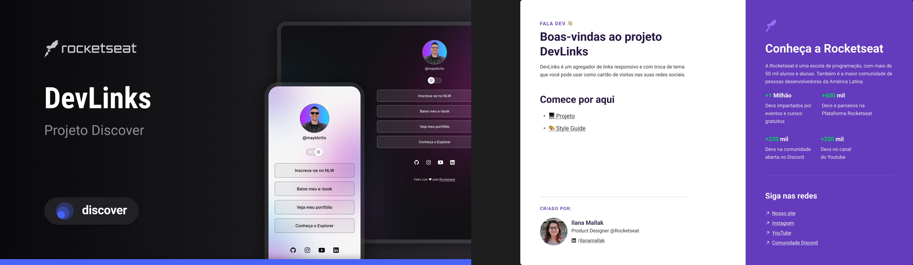

<hi aling="center">DevLinks</h1>

Programa excluivo e gratuito, promovido pela Rocketseat para ensino de tecnologias WEB.

  <a href="#-tecnologias">Tecnologias</a>&nbsp;&nbsp;&nbsp;|&nbsp;&nbsp;&nbsp;
  <a href="#-projeto">Projeto</a>&nbsp;&nbsp;&nbsp;|&nbsp;&nbsp;&nbsp;
  <a href="#-layout">Layout</a>&nbsp;&nbsp;&nbsp;|&nbsp;&nbsp;&nbsp;
  

  

  

## Tecnologias

  Esse projeto foi desenvolvido com as seguintes tecnologias:

  - HTML e CSS
  - JavaScript
  - Git e Github
  - Figma

## Projeto

  O DevLinks é um agregador de links para usar como cartão de visitas online.

## Layout

  Você pode visualizar o layout desse projeto através [DESSE LINK]
  (https://www.figmax.com/file/MF894TdzM99Fg95su4KyMq/DevLinks-(Copy)?node-id=1%3A113&t=8x94o7ecTaQMC2CS=1/duplicate). É necessário ter conta o [Figma](https://figma.com) para acessá-lo.

  ## :memo: Licença

  Esse projeto está sob a licença MIT.

  ---

  Feito com ♥ by Rocketseat :wawe: [Participe da nossa comunidade!]
  (https://discord.gg/rocketeat)

